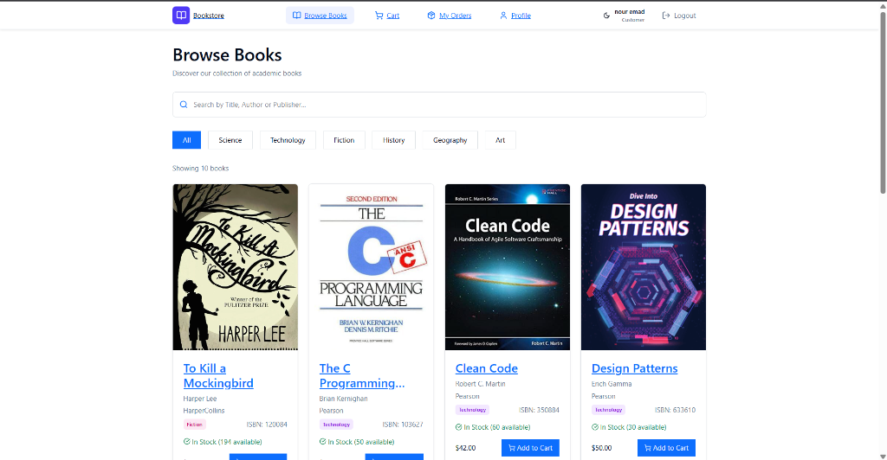
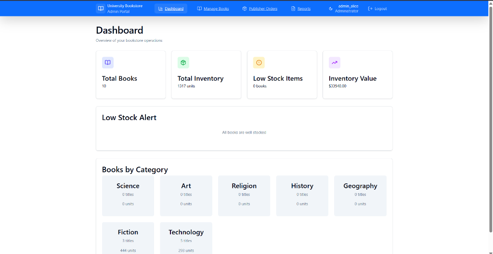

# Order Processing System

A sophisticated, full-stack book management and order processing platform designed for academic and general bookstores. This project features a robust TypeScript codebase, a premium aesthetic with dark/light mode, and advanced inventory management capabilities.

## 🚀 Key Features

### 👤 User Roles & Authentication
*   **Dual Roles**: Specialized dashboards for Admins and Customers.
*   **Secure Auth**: JWT-based authentication with bcrypt password hashing.

### 📚 Admin Dashboard
*   **Book Management**: Full CRUD operations for the book catalog.
*   **Advanced Media**: 
    - Direct image upload for book covers.
    - **Instant Preview**: View selected covers immediately before saving.
    - **Smart Deletion**: Options to remove covers with automatic disk cleanup.
*   **Inventory Control**: Real-time stock tracking with low-threshold alerts.
*   **Publisher Orders**: Streamlined replenishment ordering system.
*   **Analytics**: Generate reports for sales and inventory status.

### 🛒 Customer Experience
*   **Discovery**: Real-time search by title, author, or ISBN.
*   **Filtering**: Dynamic filtering by academic categories (Science, Technology, Fiction, etc.).
*   **Premium UI**: Color-coded category tags for enhanced readability in both light and dark modes.
*   **Shopping Cart**: Fully functional cart with quantity management.
*   **Order History**: Track past purchases and order statuses.

### 🎨 Design & UX
*   **Premium Aesthetics**: Curated HSL-based color palettes.
*   **Responsive**: Optimized for both desktop and mobile viewing.
*   **Themes**: Native dark mode support with tailored contrast.

## 📸 Screenshots

### Customer Home Page


### Admin Dashboard



---

## 🛠 Tech Stack

| Layer | Technologies |
| :--- | :--- |
| **Frontend** | React 19, Vite, Tailwind CSS 4, Axios, Lucide Icons, Bootstrap 5 |
| **Backend** | Node.js, Express, Multer (Multipart uploads), Zod (Schema validation) |
| **Database** | MySQL 8.x |
| **Language** | TypeScript (Strict Mode) |

---

## 📂 Project Structure

```text
Order-Processing-System/
├── Frontend/                 # React client application
│   ├── src/
│   │   ├── Components/       # UI Components (Dashboards, UI Kit, Forms)
│   │   ├── services/         # API Service Layer (Axios)
│   │   ├── styles/           # Global design system & Tailwind config
│   │   └── App.tsx           # Main application shell & Routing
├── server/                   # Express.js backend
│   ├── src/
│   │   ├── modules/          # Business logic domains (books, orders, cart)
│   │   ├── middleware/       # Auth guards, File uploads, Error handling
│   │   └── dataStore/        # Database access layer (DAO Pattern)
│   └── uploads/              # Physical storage for cover images
├── shared/                   # Shared TypeScript interfaces & types
├── database.sql              # Core database schema and initial data
└── package.json              # Root build scripts
```

---

## 📋 Requirements

For a complete list of dependencies and versions, see [requirements.txt](./requirements.txt).

### System Requirements
*   **Node.js**: v18.0.0 or higher
*   **npm**: v9.0.0 or higher
*   **MySQL Server**: v8.0 or higher
*   **TypeScript**: v5.0 or higher

---

## ⚙️ Setup & Installation

### 1. Prerequisites
- **Node.js**: v18 or higher
- **MySQL**: 8.0+

### 2. Database Initialization
1. Create a new MySQL database: `CREATE DATABASE bookstore;`
2. Import the schema:
   ```bash
   mysql -u your_user -p bookstore < database.sql
   ```

### 3. Backend Configuration
1. Navigate to the `server` directory:
   ```bash
   cd server
   npm install
   ```
2. Create a `.env` file in the `server` root:
   ```env
   DB_HOST=localhost
   DB_USER=your_mysql_user
   DB_PASSWORD=your_mysql_password
   DB_NAME=bookstore
   JWT_SECRET=your_secret_key_here
   ```
3. Start the server:
   ```bash
   npm run dev
   ```

### 4. Frontend Configuration
1. Navigate to the `Frontend` directory:
   ```bash
   cd Frontend
   npm install
   ```
2. Start the development server:
   ```bash
   npm run dev
   ```
3. Open `http://localhost:5173` in your browser.

---

## 📝 License
This project is licensed under the ISC License.